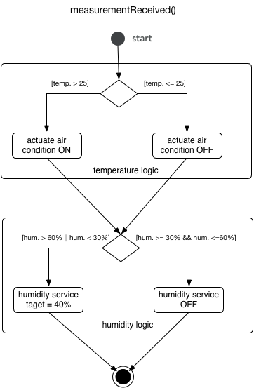
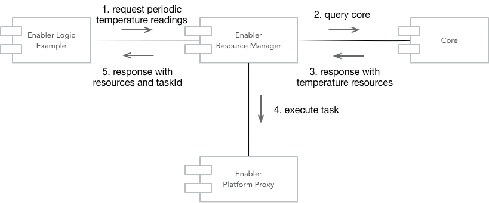
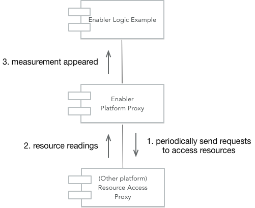
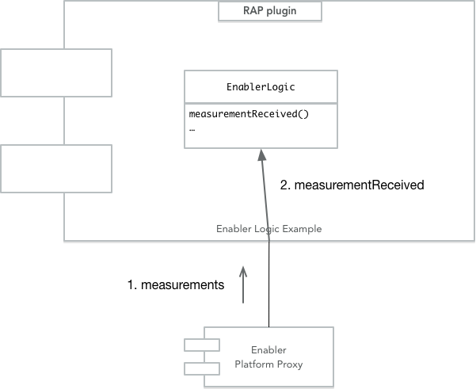
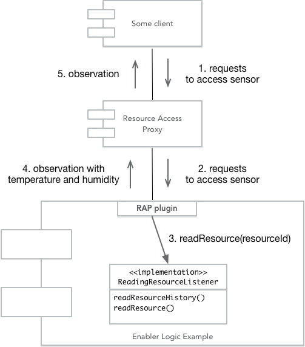
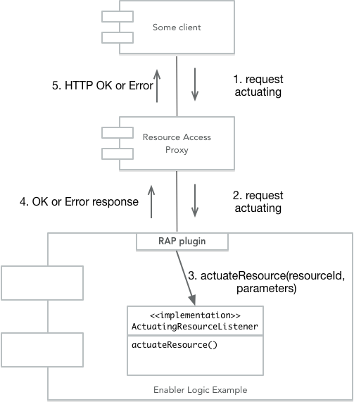
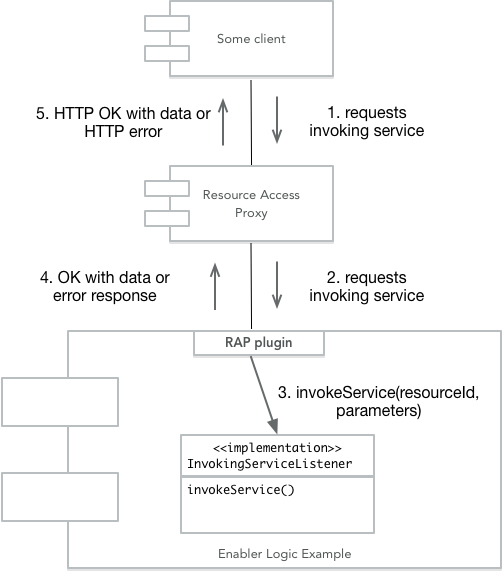

# Enabler Logic Example

This is example used in this documentation 
[https://github.com/symbiote-h2020/EnablerLogic](https://github.com/symbiote-h2020/EnablerLogic).

The Enabler Logic Eaxample (ELE) registers 3 resources:

- Sensor with temperature and humidity
- Actuator for starting and stopping Air Condition (AC)
- Service for controlling humidity (perameters are OFF or target humidity)

The logic is explained in following activity diagram.

## 1. Starting Enabler

Whena enabler is started first thing it do is registering resouces, then it register RAP consmers and then it sends message to Enabler Resource manager to start task about getting temperature data on periodic basis. 

This last proces is shown in following figure.

## 2. Reciving data

When there is time to receive data Enabler Platform Proxy startes requests to resources which is explained in following diagram.

After measurement appeared Enabler Platform Proxy send message about that to Enabler Logic and it calls method `measurementReceived` in `EnablerLogic` class (see following diagram).

After that logic is started.

## 3. Handling Reading Sensor Data in Enabler Logic

## 4. Handling Actuating Resource in Enabler Logic

## 5. Handling Invoking Service in Enabler Logic

